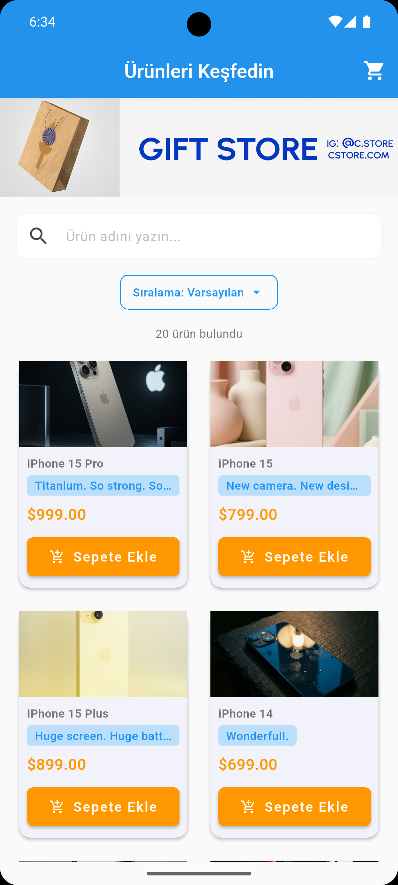
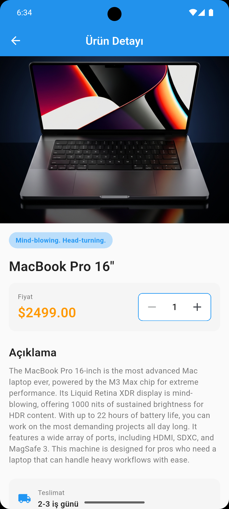
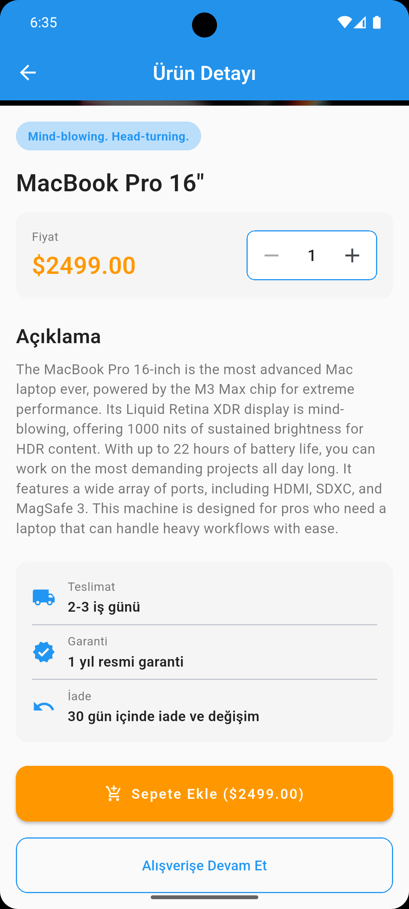
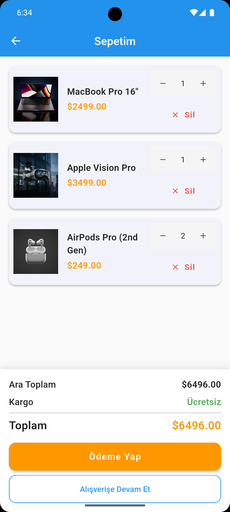

# Mini Katalog Uygulaması

Flutter ile geliştirilmiş basit bir e-ticaret katalog uygulaması. Ürün listeleme, detay görüntüleme ve sepet yönetimi özelliklerini içerir.

## Flutter Sürümü

```
Flutter: 3.35.3
Dart: 3.9.2
```

## Çalıştırma Adımları

```bash
# 1. Projeyi klonlayın
git clone https://github.com/anacbetul/mini_catalog_app.git
cd mini-katalog-app

# 2. Bağımlılıkları yükleyin
flutter pub get

# 3. Uygulamayı çalıştırın
flutter run
```


## Ekran Görüntüleri




